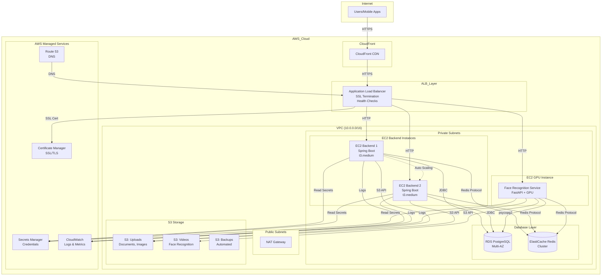
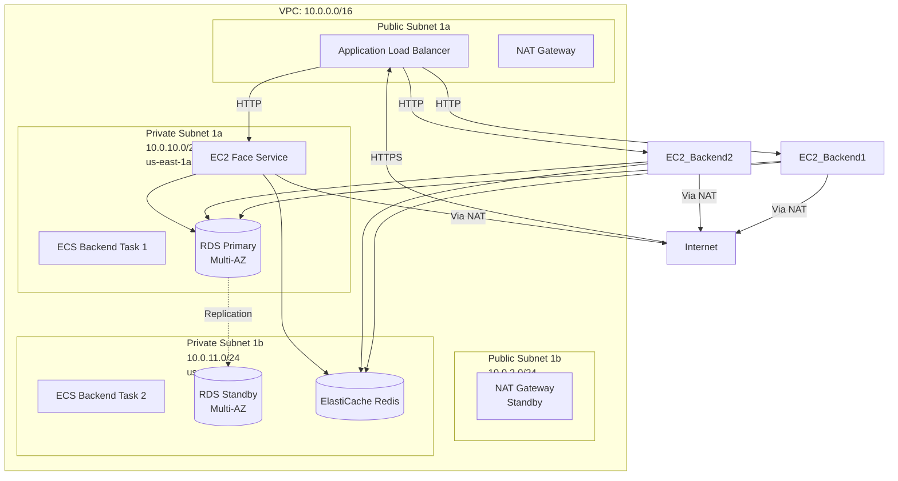
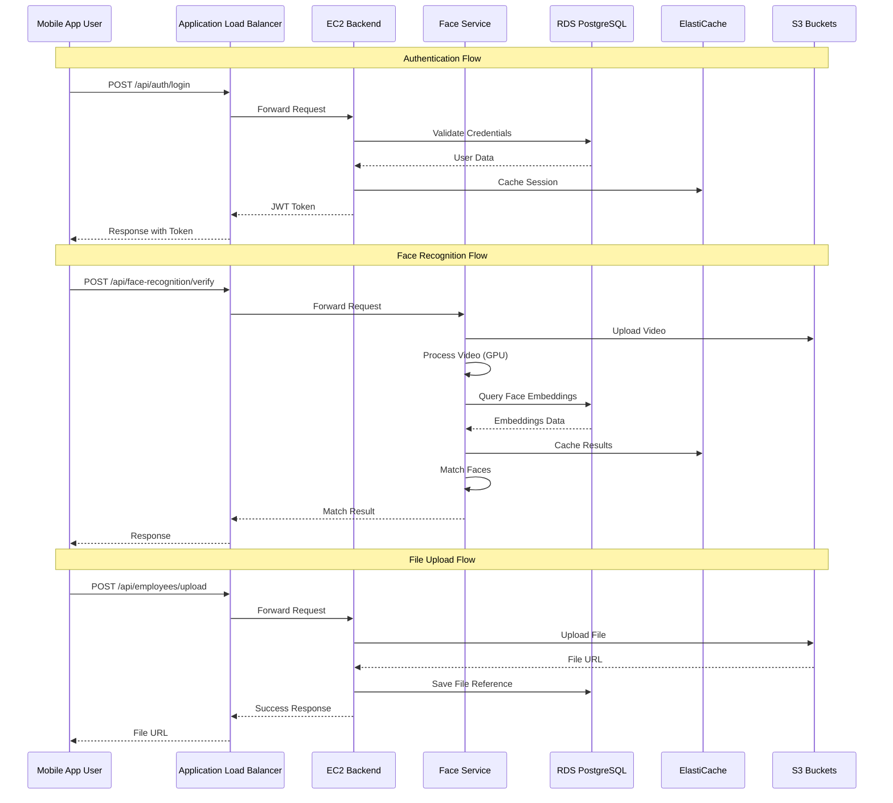
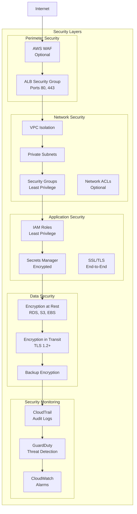
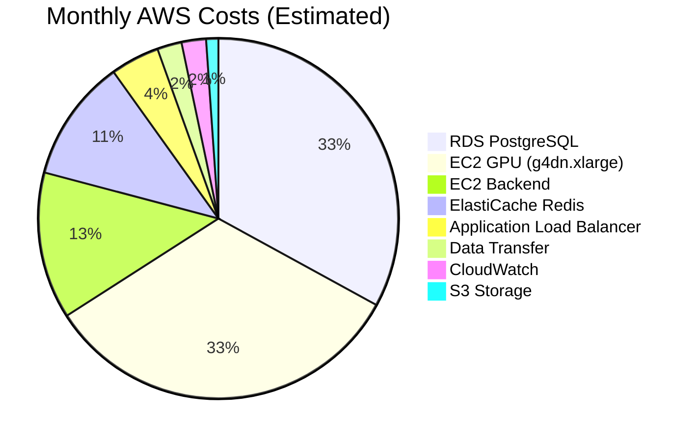
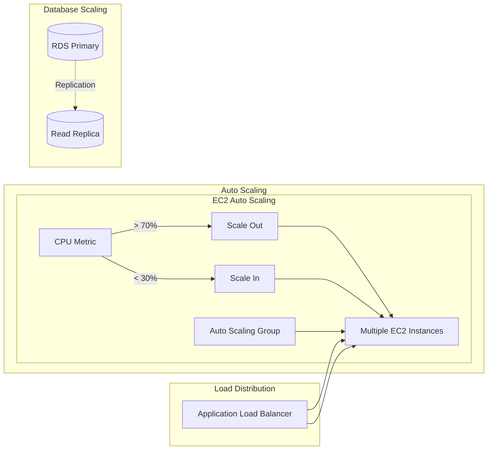

# Civildesk AWS Architecture Diagrams

This document contains architecture diagrams in multiple formats for visualization.

---

## Architecture Overview (Mermaid)



---

## Network Architecture (Mermaid)



---

## Data Flow Diagram (Mermaid)



---

## Security Architecture (Mermaid)



---

## High Availability Architecture

```
┌─────────────────────────────────────────────────────────────┐
│                    Multi-AZ Deployment                       │
└─────────────────────────────────────────────────────────────┘

Availability Zone 1 (us-east-1a)          Availability Zone 2 (us-east-1b)
┌──────────────────────────────┐          ┌──────────────────────────────┐
│ Public Subnet                │          │ Public Subnet                │
│ - ALB Listener               │          │ - ALB Listener               │
│ - NAT Gateway (Active)       │          │ - NAT Gateway (Standby)     │
└──────────────────────────────┘          └──────────────────────────────┘
           │                                        │
           │                                        │
┌──────────────────────────────┐          ┌──────────────────────────────┐
│ Private Subnet               │          │ Private Subnet               │
│ - EC2 Backend Instance 1      │          │ - EC2 Backend Instance 2    │
│ - EC2 Face Service (Primary) │          │ - EC2 Face Service (Standby) │
│ - RDS Primary                │◄─────────┤ - RDS Standby (Multi-AZ)    │
│ - ElastiCache Node 1         │ Repl     │ - ElastiCache Node 2         │
└──────────────────────────────┘          └──────────────────────────────┘
           │                                        │
           └────────────────┬───────────────────────┘
                           │
                  ┌────────┴────────┐
                  │   S3 Buckets     │
                  │  (Multi-Region)  │
                  └──────────────────┘
```

---

## Cost Breakdown by Service



---

## Scaling Architecture



---

## Disaster Recovery Architecture

```
Primary Region (us-east-1)              Secondary Region (us-west-2)
┌──────────────────────────┐            ┌──────────────────────────┐
│ - EC2 Auto Scaling Group │            │ - EC2 Auto Scaling Group │
│ - RDS (Multi-AZ)         │            │ - RDS Read Replica       │
│ - ElastiCache            │            │ - ElastiCache (Standby)  │
│ - S3 Buckets             │───────────►│ - S3 Cross-Region Repl  │
│ - ALB                    │   Backup   │ - ALB (Standby)         │
└──────────────────────────┘            └──────────────────────────┘
         │                                        │
         └────────────────┬───────────────────────┘
                         │
              ┌───────────┴───────────┐
              │   Backup Strategy      │
              │ - RDS Automated        │
              │ - S3 Versioning        │
              │ - EC2 Launch Templates │
              │ - Configuration Files  │
              └────────────────────────┘
```

---

## Export Formats

### For Draw.io / Lucidchart

1. Copy the Mermaid diagrams above
2. Use online Mermaid editor: https://mermaid.live/
3. Export as PNG, SVG, or PDF
4. Import into draw.io or Lucidchart

### For Documentation

- Use Mermaid in Markdown (GitHub, GitLab support)
- Export as images for presentations
- Use in Confluence, Notion, or other documentation tools

---

## Architecture Components Summary

| Component | Service | Purpose | High Availability |
|-----------|---------|---------|-------------------|
| Load Balancing | ALB | Distribute traffic, SSL termination | Multi-AZ |
| Backend API | EC2 (t3.medium) | Spring Boot application | Auto-scaling, Multi-AZ |
| Face Recognition | EC2 GPU | FastAPI service with GPU | Auto Scaling Group |
| Database | RDS PostgreSQL | Primary data store | Multi-AZ, Automated backups |
| Cache | ElastiCache Redis | Session storage, caching | Cluster mode (optional) |
| File Storage | S3 | Documents, images, videos | Cross-region replication |
| Secrets | Secrets Manager | Credential storage | Multi-region |
| Monitoring | CloudWatch | Logs, metrics, alarms | Global service |
| DNS | Route 53 | Domain management | Global service |
| SSL/TLS | ACM | Certificate management | Global service |

---

**Last Updated**: December 2024

